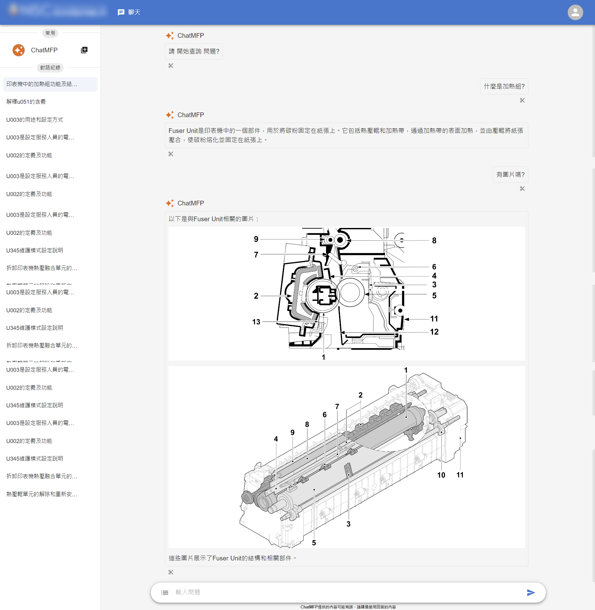

 
  # ChatMFP
  

# Demostrate
||
|:--:|
|(LLM Response 1)|

||
|:--:|
|(LLM Response 2)|

# Introduction
The ChatMFP is a GPT Assistant for printer engineering that helps improve the maintenance process. The ChatMFP uses LLMs like GPT to answer user queries. Basically, GPT doesn't contain a knowledge base about the service manuals from Kyocera or Epson, and the RAG structure was born for this. We use a Vector Store to store the PDFs in vector form and use Vector Search to retrieve the similar document by user query. In this way, LLMs can have context to answer the user query, creating an intelligent impression. But actually, LLM didn't learning any knowledge or having knowledge base on it self.

# RAG
The RAG named `Retrieval-Augmented Generation`, the terminology meaning for structure that helps extending the LLM knowledge base, helps to having conversation capability for the business internal data. Basically, 
the RAG structure looks like on below:
||
|:--:|
|(Reference from AWS)|

# Services
The most of services in the project are provided by Azure, basically, these services automatically creation from LlamaIndex Language Framework

# How is Working ?
The detailed process on `Query Flow`, this section simply describe in a few words:
1. Cracking the PDF into markdown syntax (plain text)
2. Split the PDF from markdown
3. Embedding the markdown that splited
4. Using user query to retrieve the nodes
5. Get the previous and next nodes from each retrieval nodes
6. Reranking the nodes
7. Take the nodes for first three or more nodes content as context for LLM
8. LLM based on the context to answer the query

# Tech Stack
1. RAG (Retrieval-Augmented Generation)
2. React.JS
3. Python Flask
4. Flask-SocketIO
5. Progressive Web Application
6. Docker
7. Azure
8. Redis From Docker - Storing the current conversation to get better context memory
9. MongoDB From Azure - Storing the document nodes content and relationships between nodes

# Deploy The Server（Provided By Clyde）
The Python Flask must be deployed on Linux OS because the WSGI server does not behave with great capability on Windows Server. For more details about how to deployment, please read the documentation on here.
> [How To Deploy The Flask-SocketIO And React.js On Linux For Production ?](https://medium.com/@asd66998854/deploy-the-flask-socketio-and-react-js-on-linux-step-by-step-adb01ab9db1e)
